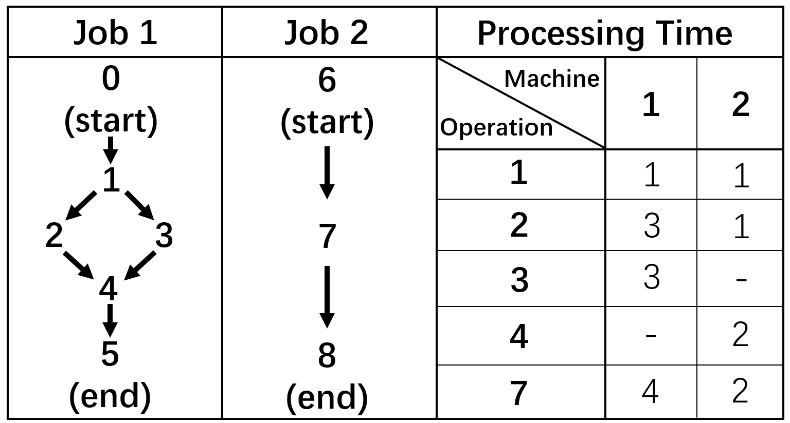

# IPPS-DRL


Official implementation of [*Solving Integrated Process Planning and Scheduling Problem via Graph Neural Network Based Deep Reinforcement Learning*](https://arxiv.org/abs/2409.00968).

A GPU-parallel DRL environment for Integrated Process Planning and Scheduling (IPPS), with a heterogeneous-graph state, PPO / Behavior Cloning training, greedy dispatch rules, and OR-Tools / Gurobi MILP baselines. The environment also supports dynamic scenarios — adding jobs mid-schedule and changing processing times.

## Repository layout

```
ipps-drl/
├── src/ipps_drl/          # Importable package (pip install -e .)
│   ├── env/               # IPPSEnv, state representation, data loader
│   ├── network/           # Heterogeneous GAT model + graph batching
│   ├── models/            # PPO, Behavior Cloning, policy, replay memory
│   ├── inference/         # InferenceEngine: greedy / sampling / MCTS
│   ├── generator/         # Job + IPPS instance generators
│   ├── greedy/            # Greedy dispatching rules
│   ├── utils/             # Padding helpers, gantt drawing, C++ env wrapper
│   ├── validate.py        # validate() / get_validate_env() used by training scripts
│   └── dataset.py         # Dataset used by Behavior Cloning
├── scripts/               # Entry-point scripts (training / evaluation)
│   ├── train_drl.py
│   ├── train_bc.py
│   ├── test.py
│   ├── greedy_test.py
│   └── run_mcts_batch.py  # batch MCTS evaluation
├── baselines/             # External solvers
│   ├── ipps_ortools_solve.py
│   └── ipps_gurobi_solve.py
├── data/                  # Problem / solution data
│   ├── dev/               # Validation instances used during training
│   ├── test/              # Benchmark test instances
│   ├── jobs/              # Pre-generated job pools (job_with_mas_3, job_with_mas_5)
│   └── example/           # Tiny illustrative instance (problem.ipps + solution)
├── checkpoints/           # Pre-trained model weights (.pt)
├── config.yaml            # All run parameters
├── pyproject.toml         # Build/install metadata
├── requirements.txt
└── LICENSE
```

## Installation

```bash
# (Optional) create a fresh env
conda create -n ipps-drl python=3.10 && conda activate ipps-drl

# Install the package in editable mode along with deps
pip install -e .
```

`requirements.txt` lists `torch`, `torch_geometric`, `torch_scatter`, `omegaconf`, `pandas`, `wandb`, `ortools`, and so on. CUDA wheels for `torch_*` packages should match your local CUDA version — see the `torch_geometric` installation page for the right index URL.

## Quick start

All hyper-parameters and dataset paths live in [`config.yaml`](config.yaml).

```bash
# Train with PPO
python scripts/train_drl.py

# Train with Behavior Cloning
python scripts/train_bc.py

# Evaluate trained checkpoints on the benchmark set
python scripts/test.py

# Compare against greedy dispatching rules
python scripts/greedy_test.py
```

[Weights & Biases](https://wandb.ai/) logging is gated by `use_wandb = True/False` at the top of each script.

## Inference API

For one-off inference (without running the full test-script pipeline) use
[`ipps_drl.inference.InferenceEngine`](src/ipps_drl/inference/engine.py). It wraps
the trained PPO policy and exposes three methods through a single `solve()` call:

```python
from ipps_drl.inference import InferenceEngine

engine = InferenceEngine(checkpoint="checkpoints/0605.pt", device="cuda:0")

# DRL-G: deterministic argmax rollout
result = engine.solve("data/test/kim/problem/problem01.ipps", method="greedy")
print(result.makespan, result.schedule.shape)

# DRL-S: parallel sampling, keep best
result = engine.solve("problem.ipps", method="sampling", num_sample=25, num_average=2)

# MCTS: search with the policy as a prior (requires the C++ env wrapper)
result = engine.solve("problem.ipps", method="mcts", time_limit=60, exploration=5)

# Batched
results = engine.solve_many([f"problem{i:02d}.ipps" for i in range(1, 25)],
                            method="greedy")
```

Each call returns an
[`InferenceResult`](src/ipps_drl/inference/result.py) with `makespan`,
`schedule` (numpy array, columns `[op_id, mas_id, job_id, start, end]`),
`wall_time_s`, and method-specific `extras`.

The MCTS path depends on the optional C++ environment wrapper bundled at
[`src/ipps_drl/utils/IPPS_ENV_CPP`](src/ipps_drl/utils/IPPS_ENV_CPP)
(vendored from <https://github.com/Lhongpei/IPPS_ENV_CPP>, plus a Cython
binding). Build it once with:

```bash
pip install cython
cd src/ipps_drl/utils/IPPS_ENV_CPP/pywrap
python setup.py build_ext --inplace
```

See [`IPPS_ENV_CPP/README.md`](src/ipps_drl/utils/IPPS_ENV_CPP/README.md)
for details. The greedy/sampling paths require only the standard
`torch`/`torch_geometric` stack and work out-of-the-box.

## Components

### Environment (`ipps_drl.env`)
- `IPPSEnv` — vectorised, GPU-friendly batched environment with the usual `step`, `reset`, `validate_gantt`, `get_schedule` API; plus `add_job` and `proc_time_change` for dynamic settings.
- `load_data.py` — `.ipps` instance loader.

### Network (`ipps_drl.network`)
- `hetero_data.Graph_Batch` — heterogeneous-graph batch with in-place feature / edge-subgraph updates.
- `models.GraphEmbedding` — Heterogeneous GATv2 stack; plus MLP `Actor` / `Critic`.
- Built on [pytorch_geometric](https://github.com/pyg-team/pytorch_geometric).

### Algorithms (`ipps_drl.models`)
- `policy.Policy` / `DRLPolicy` / `ExpertPolicy` — common embedding/probability machinery shared between DRL and IL.
- `ppo.PPO` and `bc.BehaviorCloning`.
- `memory.MemoryRL` / `MemoryIL` — trajectory buffers.
- `expert.Expert` — wraps `ExpertPolicy` for IL data generation.

### Generators (`ipps_drl.generator`)
- `jobs_generator.py` — random DAG-based job generation (uses [DAG_Generator](https://github.com/Livioni/DAG_Generator)).
- `case_generator_ipps.py` — combines jobs into full IPPS instances.

### Baselines
- Greedy dispatching rules: [`src/ipps_drl/greedy/greedy_rules.py`](src/ipps_drl/greedy/greedy_rules.py).
- OR-Tools CP-SAT solver: [`baselines/ipps_ortools_solve.py`](baselines/ipps_ortools_solve.py):

  ```bash
  python baselines/ipps_ortools_solve.py \
    --file_folder=<file_folder> \
    --save_folder=<save_folder> \
    --time_limit=<time_limit> \
    --workers=<workers>
  ```

- Gurobi MILP: [`baselines/ipps_gurobi_solve.py`](baselines/ipps_gurobi_solve.py).

## File format

### Problem (`.ipps`)

Four sections:

1. **Header**: `[num_jobs] [num_machines] [num_operations]`
2. **Graph (`out`)**: each line `a b c` means edges `a → b` and `a → c`. Operands wrapped in parentheses `(b,c)` indicate an OR-connector.
3. **Join (`in`)**: `a (b,c)` means `b` and `c` are the tails of two OR branches that join at `a`.
4. **Processing time (`info`)**: `[ope_id] [n] [mas_id] [proc_time] [mas_id] [proc_time] ...`

### Solution (`.ippssol`)

First line is total makespan; each subsequent line is `[Operation] [Machine] [Job] [Start_time] [End_time]`.

### Example

A 2-job / 2-machine illustration ("-" = machine cannot process the operation):



The instance + solution live in [`data/example/problem.ipps`](data/example/problem.ipps) and [`data/example/solution.ippssol`](data/example/solution.ippssol).

## References

- pytorch_geometric — <https://github.com/pyg-team/pytorch_geometric>
- fjsp-drl — <https://github.com/songwenas12/fjsp-drl>
- DAG_Generator — <https://github.com/Livioni/DAG_Generator>
- OR-Tools — <https://github.com/google/or-tools>

## License

MIT — see [`LICENSE`](LICENSE).
