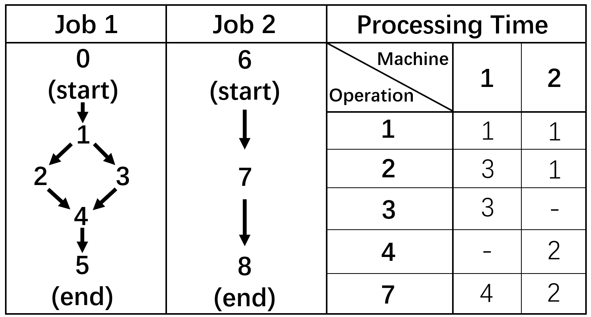

# IPPS-DRL

## Introduction

In this repository, we implement a DRL environment used for Integrated processing plans and scheduling problems. Our environment supports GPU parallel and returns a graph type as states used in both the DRL algorithm and greedy dispatching rules. Also, we implement functions to simulate the dynamic real world including adding new jobs and varying processing time during scheduling. All baselines and suggested methods can be found in this repository.

### DRL and IL implementation

Under `./models`, we implement the PPO algorithm, Behavior Cloning algorithm and policy classes.

`./models/policy.py` implements policy classes:

- `Policy` contains basic methods such as transforming embeddings of O-M pairs from graph to tensor, pooling embeddings and catting embedding and obtaining action probabilities.
  
- `DRLPolicy` and `ExpertPolicy` inherit class `Policy`, which implements methods used in DRL and IL respectively.

`./models/Expert.py` contains the class `Expert` warping `ExpertPolicy`, which is used to follow expert actions.

`./models/memory.py` contains 2 classes, `MemoryRL` and `MemoryIL` recording trajectories used for DRL and IL respectively.

`./models/ppo.py` and `./models/bc.py` implement PPO and Behavior Cloning algorithms.

### Neural Network and State

Neural networks and the class of heterogeneous graphs representing states are implemented under `./network/`.

`./network/hetero_data.py` implements a heterogeneous graph class supporting batch processing updating to accelerate.

`./network/models.py` implements the Heterogeneous GAT, the MLP-based Actor and Critic.

The classes above are implemented based on [pytorch_geometric]([PyG](https://github.com/pyg-team/pytorch_geometric)), an open-source package for graph neural networks

### Environment

The environment and other utils for data are implemented under `./env/` including the data loader, data generator and the environment.

`./env/ipps_env.py` contains `IPPSEnv` a class of the environment containing the following function:

- `self.__init__`: Initialize the environment by the received problem which can be the fjsp or ipps.

- `self.step`: Update the environment according to the action.

- `self.backup4reset`: Record the current status to allow resetting the environment to this status.

- `self.reset`: Reset the environment to the initial (or recorded) status.

- `self.add_job`: Add a job into the environment.

- `self.proc_time_change`: Change the processing time used for machines to process operations.

- `self.validate_gantt`: Validate whether a schedule is legal.

- `self.get_schedule`: Output the scheduling in the format of solutions.

### Problem Generator

Our problem generation contains 2 parts:

- Job Generation: We implement it in `./generator/Jobs_Generator.py`, which first generates a Direct acyclic graph, and then generates processing time randomly. We use [DAG_Gnerator](https://github.com/Livioni/DAG_Generator), an open-source package that supports randomly generating DAGs, in Jobs_Generator
  
- Problem Generation: It can be found in both `./generator/case_generator_ipps.py, which converts several job files into problem files.

### Greedy Dispatching rules

greedy dispatching rules are implemented in `./greedy/greedy_rules`.

### MILP Models

Our MILP model is implemented based on [OR-Tools](https://github.com/google/or-tools), an open-source solver.

Run the `ipps_ortools_solve.py` script with specified parameters:

```bash
python ipps_ortools_solve.py \  # Run the ipps_ortools_solve.py script
  --file_folder=<file_folder> \  # Specify the file folder path
  --save_folder=<save_folder> \  # Specify the save folder path
  --time_limit=<time_limit> \  # Specify the time limit
  --workers=<workers>  # Specify the number of worker threads
```

## Train and Test

`./train_bc.py` and `./train_drl.py` are scripts to use Behavior Cloning and PPO to train models, respectively.

`./text.py` is a script used to test.

All parameters and paths should be set in `./config.yaml`. We use [Weights & Biases (wandb)](https://wandb.ai/) to log the training process, which can be closed in these scripts by setting `use_wandb = False`.

## Requirements

Please refer to `./requirements.txt`.

## File Format

To our best-known, there isn't a file format to store an IPPS problem, because of the complexity of the job scheduling graph. So, we suggest a file format to store the IPPS problem. In addition, we suggest a file for the IPPS solution used for Behavior Cloning.

### Problem(.ipps)

There are 4 parts in our file format:

1. First line: [number of jobs] [number of machines] [number of operations]
2. Graph Structure: This part starts with a line of `out`, and each later line has at least 2 elements representing the operation's IDs of the start and end points of an edge, such as `a b c`, which means there are edges a->b and a->c. Notice that if 2 nodes `b c` are linked to an OR-connector, they will be written as `(b,c)`
3. Join: This part is used to store the join nodes and starts with a line of `in`. In each line, `a (b,c)` means that b and c are the last operations in 2 OR braches and join to a.
4. Processing time: This part starts with a line of `info`. Each later line starts with the machine's IDs. The second element `n` notes how many operations this machine can process, and then fills `2n` elements, where 2i-1 th and 2i th elements note an operation ID and the processing time.

### Solution(.ippssol)

The file stores a solution starting with a line of total makespan, and each line is later formatted as `[Operation] [Machine] [Job] [Start_time] [End_time]` for each schedule.

### Example

Consider the following simple problem with 2 jobs and 2 machines:



"-" means that this machine can not process this operation.

The file stores this simple problem can be found in  `./example/problem.ipps` and `./example/problem.ippssol`.

## Reference

https://github.com/pyg-team/pytorch_geometric

https://github.com/songwenas12/fjsp-drl

https://github.com/Livioni/DAG_Generator

https://github.com/google/or-tools